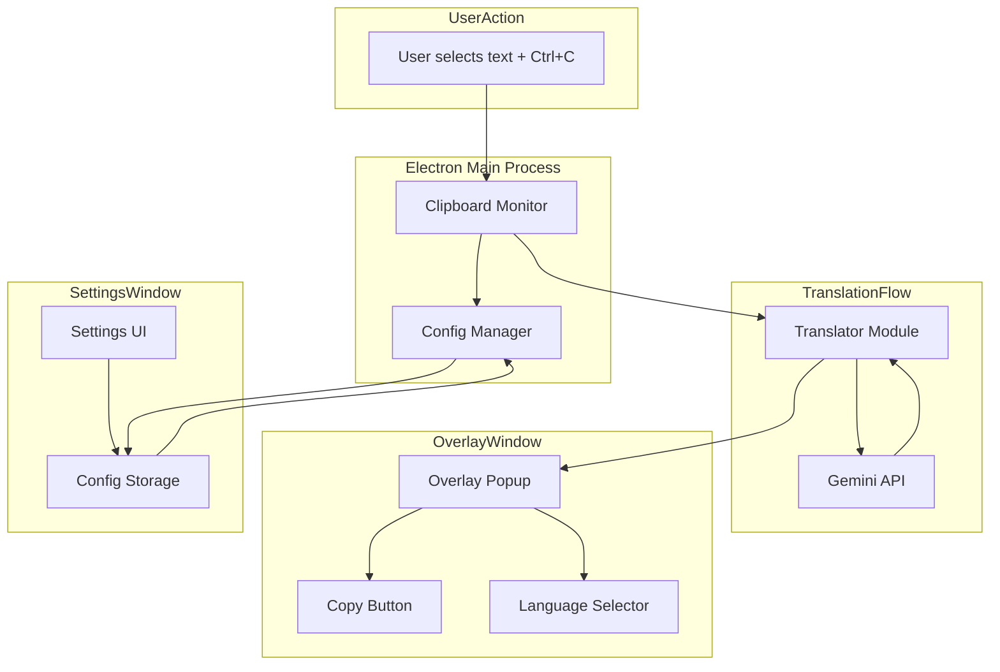
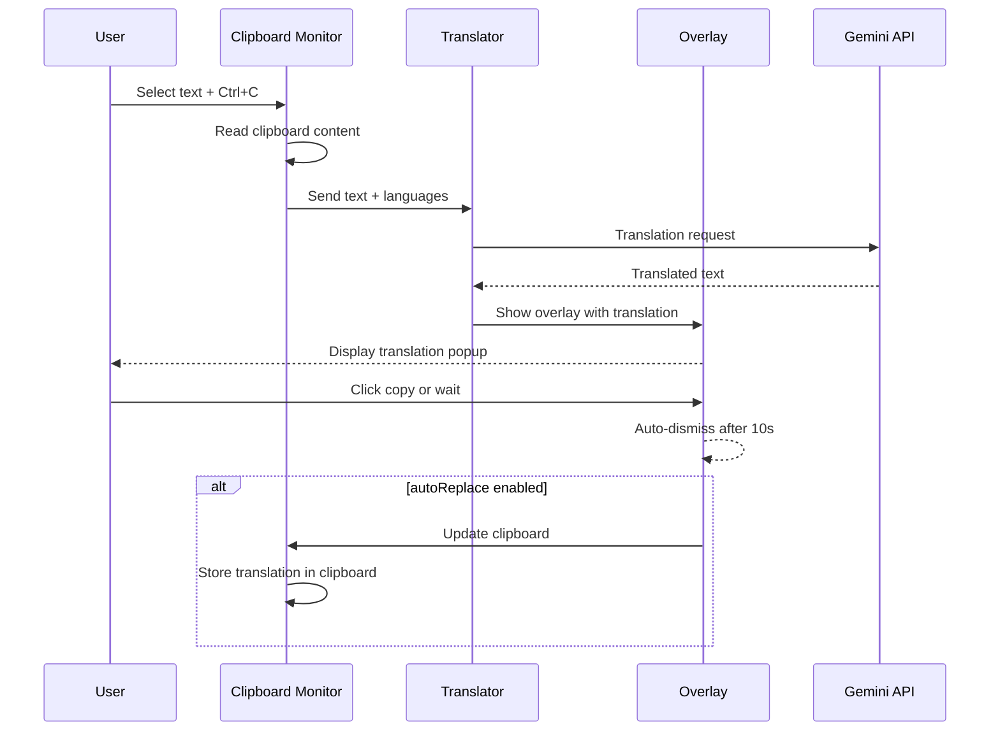

# Translate Overlay IA - Architectural Plan

## Overview
A cross-platform desktop translation tool using Electron and Google Gemini API that monitors clipboard (on Ctrl+C) and displays a translation overlay popup. Similar to DeepL's quick translation feature.

## Gemini Model Selection

**Recommended Model: `gemini-2.0-flash`**

| Criteria | Value |
|----------|-------|
| Input price | $0.10 per 1M tokens |
| Output price | $0.30 per 1M tokens |
| Speed | Very fast (optimized for low latency) |
| Quality | Excellent for translation tasks |
| Why | Best cost/performance ratio for translation |

Alternative: `gemini-2.0-flash-lite` if even lower cost is needed ($0.075/$0.15 per 1M tokens) but slightly lower quality.

---

## Project Structure

```
Translate_overlay_ia/
├── package.json
├── .env.example
├── .gitignore
├── plans/
│   └── translate_overlay_ia_plan.md
├── src/
│   ├── main.js              # Electron main process
│   ├── config/
│   │   ├── default.json     # Default configuration
│   │   └── index.js         # Config manager (loads user config)
│   ├── modules/
│   │   ├── clipboard.js     # Clipboard monitoring
│   │   ├── translator.js    # Gemini API integration
│   │   └── overlay.js       # Translation overlay window
│   ├── preload.js           # Electron preload script
│   └── renderer/
│       ├── index.html       # Settings window HTML
│       ├── settings.js      # Settings window logic
│       └── settings.css     # Settings window styles
├── assets/
│   └── icon.png             # App icon
└── dist/                    # Build output
```

---

## System Architecture



---

## Core Modules Detail

### 1. Configuration System (`src/config/`)

**Default Configuration (`default.json`):**
```json
{
  "gemini": {
    "apiKey": "",
    "model": "gemini-2.0-flash",
    "maxTokens": 4096
  },
  "translation": {
    "sourceLanguage": "auto",
    "targetLanguage": "en",
    "preferredLanguages": ["en", "es", "fr", "de", "pt"],
    "overlayPosition": "cursor",
    "overlayOpacity": 0.95,
    "overlayFontSize": 14,
    "autoReplace": true,
    "copyToClipboard": true
  },
  "hotkey": {
    "triggerKey": "Ctrl+C",
    "copyTranslationKey": "Ctrl+Shift+C"
  },
  "appearance": {
    "theme": "dark",
    "borderRadius": 12,
    "shadow": true
  }
}
```

**Language Codes (ISO 639-1):**
- `auto` - Auto-detect source language
- `en` - English
- `es` - Spanish
- `fr` - French
- `de` - German
- `pt` - Portuguese
- `it` - Italian
- `ja` - Japanese
- `zh` - Chinese
- `ko` - Korean
- `ru` - Russian
- `ar` - Arabic

### 2. Clipboard Monitor (`src/modules/clipboard.js`)

**Responsibilities:**
- Listen for Ctrl+C hotkey globally using `globalShortcut`
- Capture selected text before clipboard update
- Detect if text is from editable field vs external app
- Trigger overlay with translation when text is captured

**Implementation:**
```javascript
const { globalShortcut, clipboard, ipcMain } = require('electron');

class ClipboardMonitor {
  constructor() {
    this.lastSelectedText = null;
    this.isEditableContext = false;
  }
  
  registerHotkey(hotkey) {
    globalShortcut.register(hotkey, () => {
      // Capture selected text
      const selectedText = this.getSelectedText();
      if (selectedText && selectedText.trim().length > 0) {
        this.lastSelectedText = selectedText.trim();
        this.isEditableContext = this.isEditableContext || false;
        // Send to main for translation
        ipcMain.emit('translate-request', null, {
          text: this.lastSelectedText,
          isEditable: this.isEditableContext
        });
      }
    });
  }
  
  getSelectedText() {
    return clipboard.readText();
  }
}
```

### 3. Translator Module (`src/modules/translator.js`)

**Responsibilities:**
- Call Gemini API with translation prompt
- Handle API errors and rate limiting
- Cache frequent translations

**Implementation:**
```javascript
const { GoogleGenerativeAI } = require('@google/generative-ai');

class Translator {
  constructor(config) {
    this.genAI = new GoogleGenerativeAI(config.apiKey);
    this.model = this.genAI.getGenerativeModel({ model: config.model });
    this.cache = new Map();
    this.cacheLimit = 100;
  }
  
  async translate(text, sourceLang, targetLang) {
    const cacheKey = `${text}:${sourceLang}:${targetLang}`;
    
    if (this.cache.has(cacheKey)) {
      return this.cache.get(cacheKey);
    }
    
    const langMap = {
      'auto': 'auto-detect',
      'en': 'English',
      'es': 'Spanish',
      'fr': 'French',
      'de': 'German',
      'pt': 'Portuguese',
      'it': 'Italian',
      'ja': 'Japanese',
      'zh': 'Chinese',
      'ko': 'Korean',
      'ru': 'Russian',
      'ar': 'Arabic'
    };
    
    const sourceName = langMap[sourceLang] || sourceLang;
    const targetName = langMap[targetLang] || targetLang;
    
    const prompt = sourceLang === 'auto'
      ? `Translate the following text to ${targetName}. Return only the translation, nothing else:\n\n${text}`
      : `Translate the following text from ${sourceName} to ${targetName}. Return only the translation, nothing else:\n\n${text}`;
    
    const result = await this.model.generateContent(prompt);
    const translation = result.response.text();
    
    // Update cache
    this.cache.set(cacheKey, translation);
    if (this.cache.size > this.cacheLimit) {
      const firstKey = this.cache.keys().next().value;
      this.cache.delete(firstKey);
    }
    
    return translation;
  }
}
```

### 4. Overlay Window (`src/modules/overlay.js`)

**Responsibilities:**
- Create transparent, always-on-top popup window
- Position near cursor or selected text
- Display translation with copy button
- Auto-dismiss after timeout or manual close

**Window Properties:**
```javascript
const overlayOptions = {
  width: 400,
  height: 150,
  transparent: true,
  frame: false,
  alwaysOnTop: true,
  skipTaskbar: true,
  resizable: false,
  opacity: 0.95,
  webPreferences: {
    preload: path.join(__dirname, 'preload.js'),
    contextIsolation: true
  }
};
```

**Overlay Features:**
- Glassmorphism design with backdrop blur
- Smooth fade in/out animations
- Click-through for auto-dismiss
- Copy button to copy translation
- Language indicator
- Manual close button (X)
- Auto-hide after 10 seconds

---

## Settings Window

### UI Layout
```
┌──────────────────────────────────────┐
│  ⚙️ Translate Overlay IA    [─][✕] │
├──────────────────────────────────────┤
│                                      │
│  API Configuration                   │
│  ┌────────────────────────────────┐ │
│  │ Gemini API Key: [__________] │ │
│  │           [Show/Hide]          │ │
│  └────────────────────────────────┘ │
│                                      │
│  Translation Settings                │
│  Source Language: [Auto ▼]           │
│  Target Language: [English ▼]        │
│                                      │
│  Preferred Languages:                │
│  [✓ English] [✓ French] [✓ Spanish] │
│  [✓ German]  [✓ Portuguese] [Add]  │
│                                      │
│  Options                           │
│  [✓] Auto-replace text              │
│  [✓] Copy translation to clipboard  │
│  [✓] Show overlay on Ctrl+C         │
│                                      │
│  Overlay Appearance                  │
│  Theme: [Dark ▼]                     │
│  Font Size: [14] ▼                   │
│  Opacity: [████████░░] 95%           │
│                                      │
│                    [Save] [Reset]    │
└──────────────────────────────────────┘
```

### Settings Storage
- User config saved to `~/.translate-overlay/config.json`
- Auto-save on every change
- Export/Import configuration
- Backup on reset

---

## Hotkey System

| Hotkey | Action |
|--------|--------|
| `Ctrl+C` (when text selected) | Trigger translation overlay |
| `Ctrl+Shift+C` (in overlay) | Copy translation to clipboard |
| `Escape` | Close overlay |

---

## Auto-Replace Feature

When `autoReplace` is enabled:
1. After translation is received
2. If source was from editable context
3. Replace clipboard content with translation
4. Also display overlay showing original vs translated
5. User can revert with `Ctrl+Z` or click "Revert" in overlay

---

## Dependencies

```json
{
  "dependencies": {
    "@google/generative-ai": "^0.21.0",
    "electron-store": "^8.2.0"
  },
  "devDependencies": {
    "electron": "^32.0.0",
    "electron-builder": "^25.0.0"
  }
}
```

---

## API Key Setup

User must provide their own Gemini API key:
1. Go to [Google AI Studio](https://aistudio.google.com/apikey)
2. Create an API key (free tier available)
3. Enter key in settings window
4. Key is stored encrypted locally

---

## Flow Diagram



---

## Security Considerations

1. **API Key Storage**: Encrypted using `electron-store` with encryption
2. **No telemetry**: All processing is local, no data sent to third parties except Gemini API
3. **Context isolation**: Electron security best practices with preload script
4. **No clipboard history stored**: Only current clipboard content is read temporarily

---

## Build Configuration

```json
{
  "build": {
    "appId": "com.translate-overlay.ia",
    "productName": "Translate Overlay IA",
    "directories": {
      "output": "dist"
    },
    "files": [
      "src/**/*",
      "package.json"
    ],
    "win": {
      "target": ["nsis"],
      "icon": "assets/icon.png"
    },
    "mac": {
      "target": ["dmg"],
      "icon": "assets/icon.icns"
    },
    "linux": {
      "target": ["AppImage"],
      "icon": "assets/icon.png"
    }
  }
}
```

---

## Setup Instructions for User

1. Install Node.js (v18 or higher)
2. Run `npm install` in project directory
3. Open settings window (first launch)
4. Enter Gemini API key from [Google AI Studio](https://aistudio.google.com/apikey)
5. Configure preferred languages
6. Start using: select text + Ctrl+C

---

## Development Commands

```bash
npm install           # Install dependencies
npm start             # Run in development mode
npm run build         # Build for current platform
npm run build:win     # Build for Windows
npm run build:mac     # Build for macOS
npm run build:linux   # Build for Linux
```
